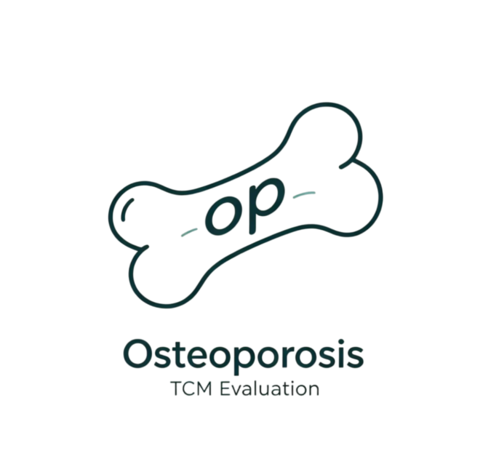
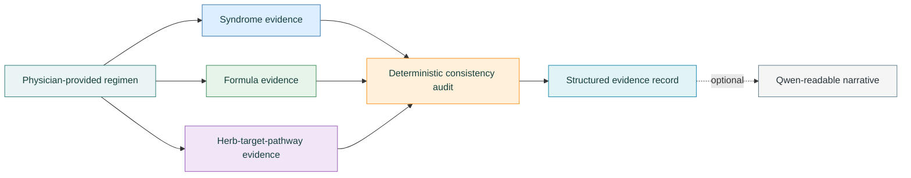

<p align="left">
  
  
  
  
  <br>
  
  
  
  
</p>

# OP-RAG Reproducibility Package

**A three-layer retrieval workflow for provenance and consistency auditing of traditional Chinese medicine prescriptions in primary osteoporosis.**

OP-RAG links syndrome, formula, and herb-target-pathway records. It retrieves source-linked evidence for a physician-provided regimen and applies predefined rules to summarize evidence coverage and cross-layer consistency.

> [!IMPORTANT]
> OP-RAG is a research workflow. It does not diagnose disease, generate prescriptions, assess treatment efficacy, or replace professional medical judgment.

<br clear="right">

## What is included

| Component | Included | Purpose |
| :--- | :---: | :--- |
| Three-layer public example knowledge base | Yes | Demonstrates syndrome, formula, and mechanism retrieval |
| Synthetic case set | Yes | Runs the public workflow without patient data |
| Deterministic evaluation code | Yes | Calculates evidence fields, coverage, missing evidence, relations, and audit levels |
| Qwen-Plus narration | Optional | Converts code-generated facts into a readable report |
| Aggregate manuscript results | Yes | Documents the reported results without releasing case-level records |
| Restricted 50-plan audit package | No | Withheld because it contains non-public research data |

## Data boundary

The default command uses the included synthetic cases and public example knowledge base:

```powershell
python scripts/run_ablation.py --no-llm
```

It reads `data/demo/synthetic_cases.jsonl` and `data/kb/`. These files reproduce the public software workflow, but they do not reproduce the manuscript's 50-plan internal audit.

The manuscript experiments used a separate private, case-informed knowledge-base extension and a restricted 50-plan audit package. These inputs are not distributed and are never selected by the default command. Their boundary and authorized local path configuration are documented in [`data/paper_internal/README.md`](data/paper_internal/README.md). Only aggregate, non-identifying manuscript outputs are provided in [`data/paper_results/`](data/paper_results/).

## Quick start

### 1. Create the environment

```powershell
conda env create -f environment.yml
conda activate op-rag-open
python --version
```

The recorded implementation used Python 3.13.6. When Conda is unavailable, install the minimal dependencies with:

```powershell
pip install -r requirements.txt
```

### 2. Run the public workflow

```powershell
python scripts/run_ablation.py --no-llm
```

By default, results are written under `outputs/demo_ablation/`:

```text
outputs/demo_ablation/
|-- g0/
|-- g1/
|-- g2/
|-- g3/
|-- g4/
`-- all_modes_summary.json
```

### 3. Run the optional test suite

```powershell
pip install pytest
python -m pytest -q
```

## Workflow



The public entry point retains the `G0-G4` workflow. The repaired manuscript experiment code also separates Flat-TFIDF, Layered-TFIDF, and Layered-Hybrid retrieval so that retrieval organization and matching strategy can be compared explicitly.

## Evaluation safeguards

The repaired implementation includes:

- exact standardized formula and herb resolution before fallback matching;
- rejection of zero-similarity herb results instead of returning arbitrary records;
- consistent retrieval limits and evidence-source exclusion rules;
- deterministic Python calculation of herb counts, coverage, missing evidence, relations, and Levels 1-4;
- Qwen-Plus restricted to qualitative narration of code-generated facts;
- numerical and semantic checks between structured outputs and generated summaries;
- separate Flat-TFIDF, Layered-TFIDF, and Layered-Hybrid retrieval protocols.

Qwen does not calculate the quantitative metrics. The fixed Python evaluator produces the structured results before any optional natural-language report is generated.

## Optional Qwen-Plus reports

Qwen-Plus is not required for the default reproducibility check. To enable optional report generation, configure the credentials only in the local environment:

```powershell
$env:QWEN_API_KEY = "your_api_key"
python scripts/run_ablation.py --use-qwen
```

Never commit API keys or local `.env` files. Provider-side model revisions may change wording, while the quantitative fields remain code-generated.

## Repository layout

```text
OP-RAG-open/
|-- assets/                 # Project logo and visual assets
|-- data/
|   |-- demo/               # Synthetic public demonstration cases
|   |-- kb/                 # Public example knowledge layers
|   |-- paper_internal/     # Boundary note for restricted inputs
|   `-- paper_results/      # Aggregate manuscript outputs
|-- experiments/            # Repaired manuscript experiment and audit code
|-- scripts/
|   `-- run_ablation.py     # Public workflow entry point
|-- src/                    # Retrieval, evaluation, prompting, and model client
|-- tests/                  # Public workflow tests
|-- CITATION.cff
`-- LICENSE
```

## Interpretation

Public-demo outputs show that the released code runs on the included example data. The manuscript results describe evidence coverage, provenance, and predefined consistency relations within a versioned internal resource. Neither result establishes diagnostic accuracy, prescription appropriateness, treatment efficacy, or clinical benefit.

## Citation

If you use this implementation, cite the associated OP-RAG manuscript. The bibliographic record in [`CITATION.cff`](CITATION.cff) should be updated when the final publication details become available.

## License

Project-owned code and documentation are released under the [MIT License](LICENSE). The project logo is distributed under the same license. Third-party data sources remain subject to their own terms and citation requirements.
