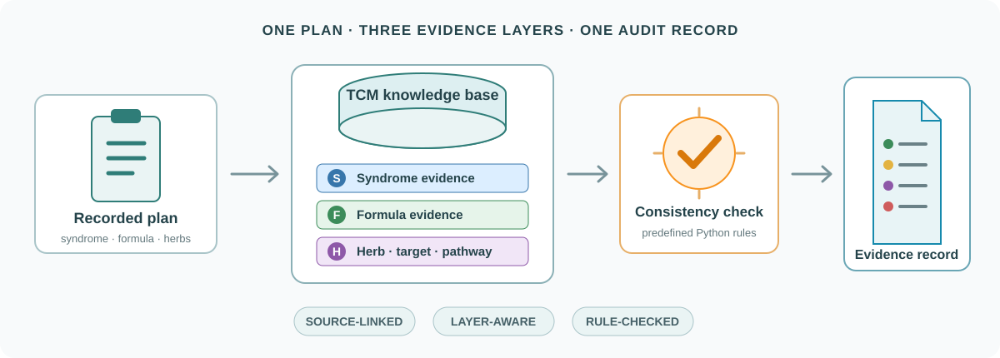

<p align="center">
  
</p>

<h1 align="center">OP-RAG: A Three-Layer Retrieval-Augmented Framework for Provenance and Cross-Layer Consistency Auditing of Traditional Chinese Medicine Prescriptions for Primary Osteoporosis</h1>

<p align="center">
  <a href="#quick-start"></a>
  <a href="#knowledge-base-viewer"></a>
  <a href="#reproducibility"></a>
</p>

<p align="center">
  
  
  
  
</p>

<p align="center">
  An open implementation of the three-layer TCM knowledge base and consistency-checking workflow described in the manuscript.
</p>

<p align="center">
  
</p>

<table>
  <tr>
    <td align="center" width="33%"><b>◫ THREE-LAYER KB</b><br><sub>Syndrome · Formula · Mechanism</sub></td>
    <td align="center" width="33%"><b>⌁ CONSISTENCY CHECK</b><br><sub>Predefined cross-layer rules</sub></td>
    <td align="center" width="33%"><b>⌕ SOURCE TRACEABILITY</b><br><sub>Inspectable evidence records</sub></td>
  </tr>
</table>

> [!IMPORTANT]
> OP-RAG supports knowledge retrieval and consistency checking. It does not diagnose disease, generate prescriptions, evaluate treatment efficacy, or replace professional medical judgment.

## Public release

| Knowledge base | Demo | Methods |
| :---: | :---: | :---: |
| **6** syndrome categories | **4** synthetic plans | Flat retrieval |
| **24** formulas | No patient data | Layered retrieval |
| **43** herb records | No API required | Cross-layer checking |

## Quick start

```powershell
conda env create -f environment.yml
conda activate op-rag-open
python scripts/run_public_demo.py
```

The demo runs four synthetic, non-patient plans through the released retrieval and rule-based checking workflow. Its generated JSON is local, Git-ignored, and **not** a manuscript result.

Run all available checks:

```powershell
python -m unittest discover -s experiments/fair_rag_20260809_fixed_v2 -p "test_*.py"
```

Tests that require the restricted 50-plan package are skipped when those inputs are absent.

## Knowledge-base viewer

```powershell
python scripts/run_herb_dashboard.py
```

Open **[http://127.0.0.1:8080](http://127.0.0.1:8080)** to search and inspect released herb, target, pathway, and reference records.

<p align="center">
  <a href="http://127.0.0.1:8080"></a>
</p>

The viewer is read-only. It makes no Qwen API request and is not part of manuscript scoring.

## System logic

| Layer | Evidence represented | Checked output |
| :--- | :--- | :--- |
| **Syndrome** | Standardized labels and sources | Syndrome evidence located or missing |
| **Formula** | Names, compositions, and syndrome–formula mappings | Formula evidence and mapped relation |
| **Mechanism** | Herb–target–pathway records and references | Mechanism-evidence coverage |

The consistency checker is not a fourth knowledge layer. It applies deterministic Python rules to the evidence retrieved from the three layers. Python calculates counts, coverage, missing evidence, relations, and Levels 1–4. Qwen-Plus is optional and may only convert those structured facts into readable prose.

## Reproducibility

<details>
<summary><b>Experimental configurations and fair comparisons</b></summary>

The manuscript code evaluates four configurations through a common external scoring framework:

| Configuration | Evidence available | Cross-layer check |
| :--- | :--- | :---: |
| Qwen only | No retrieved knowledge-base evidence | N/A |
| Flat RAG | One mixed retrieval index | No |
| Layered RAG | Three separately retrieved layers | No |
| OP-RAG | The same layered evidence plus predefined rules | Yes |

Two retrieval comparisons answer different questions:

| Comparison | Factor isolated |
| :--- | :--- |
| Flat-TFIDF vs Layered-TFIDF | Layer organization under the same retrieval method |
| Layered-TFIDF vs Layered-Hybrid | Exact standardized herb matching within the layered design |

</details>

<details>
<summary><b>Built-in safeguards</b></summary>

- Standardize formula and herb names before fallback matching.
- Return no herb result when similarity is zero.
- Fix retrieval limits and source-exclusion rules across relevant comparisons.
- Calculate every quantitative field with Python.
- Check generated prose against structured numerical and semantic facts.
- Report non-applicable Qwen-only retrieval metrics as N/A.

</details>

<details>
<summary><b>Data and result boundary</b></summary>

The default repository contains a public example knowledge base under `data/kb/` and synthetic plans under `data/demo/`. These files reproduce the released software path, schemas, deterministic calculations, interface, and tests. They do **not** reproduce the numerical results of the manuscript's restricted 50-plan audit.

The manuscript analysis used a separate case-informed knowledge-base extension and a restricted audit package. These inputs are excluded for privacy, licensing, and data-governance reasons. Authorized local configuration is documented in [`data/paper_internal/README.md`](data/paper_internal/README.md).

Retired G0–G4 aggregates, patient-level inputs, raw restricted outputs, local environment files, and API credentials are not distributed.

</details>

<details>
<summary><b>Optional Qwen-Plus narration</b></summary>

No API key is required for the public demo, viewer, or deterministic checks. In an authorized local environment:

```powershell
$env:QWEN_API_KEY = "your_api_key"
$env:QWEN_MODEL = "qwen-plus"
```

Provider-side model updates may change wording, but they cannot change code-generated quantitative fields.

</details>

## Repository map

<details open>
<summary><b>Open the project tree</b></summary>

```text
OP-RAG-open/
├── assets/                   Project visuals
├── data/
│   ├── demo/                 Synthetic non-patient plans
│   ├── kb/                   Public syndrome, formula, and herb resources
│   └── paper_internal/       Restricted-input boundary note
├── experiments/
│   └── fair_rag_20260809_fixed_v2/
│       ├── protocol.py       Retrieval and consistency-check logic
│       ├── prepare_experiment.py
│       ├── run_retrieval_strategy_ablation.py
│       ├── run_qwen_comparison.py
│       └── test_*.py         Regression and consistency checks
├── scripts/
│   ├── run_public_demo.py
│   └── run_herb_dashboard.py
├── src/op_rag/               Shared loading, configuration, and viewer code
├── environment.yml
├── requirements.txt
└── LICENSE
```

</details>

Generated outputs and Python caches are excluded from version control.

## Scope

This release demonstrates the OP-RAG knowledge-base structure, retrieval workflow, deterministic calculations, consistency checks, and safeguards. Neither the public demo nor the internal manuscript audit establishes diagnostic accuracy, prescription appropriateness, treatment efficacy, or clinical benefit.

## License

Project-owned code, documentation, and visuals are released under the [MIT License](LICENSE). Third-party data sources remain subject to their own terms and citation requirements.
